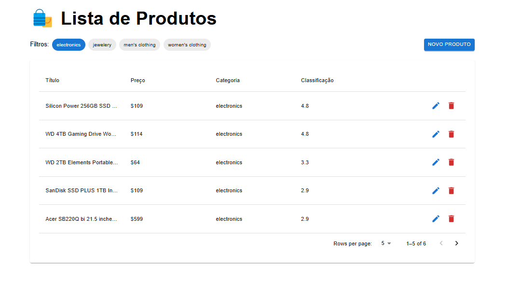
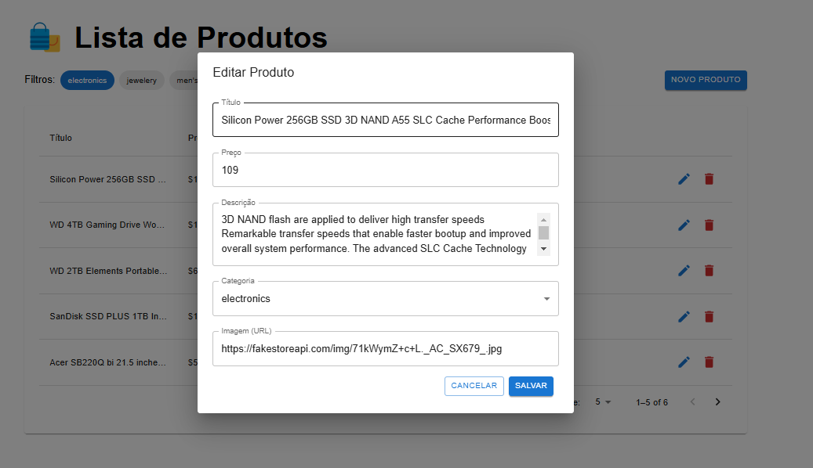
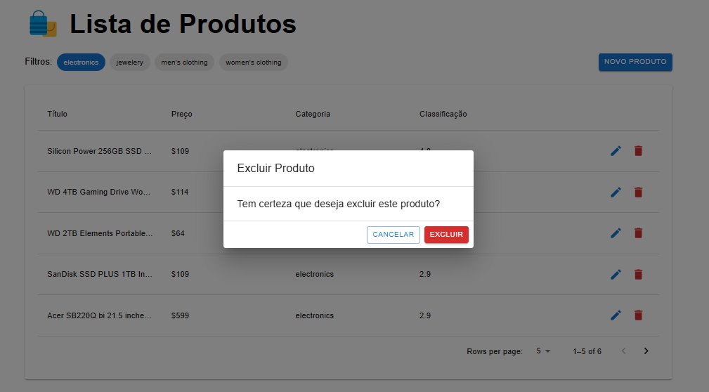
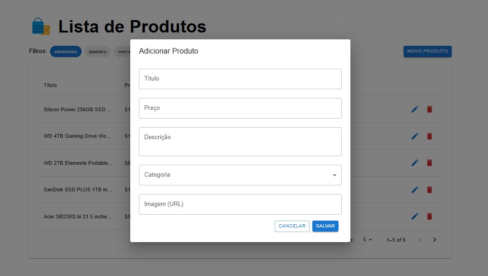
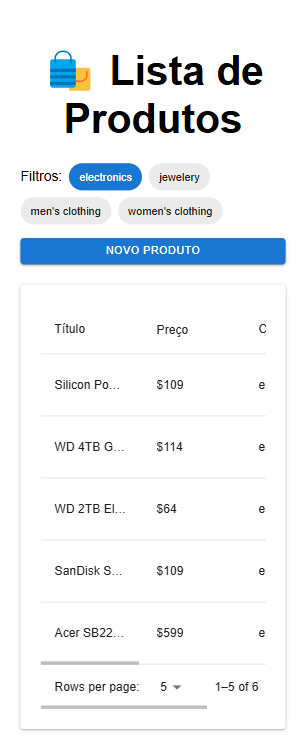

# Eadskill Store 📦

- CRUD completo de produtos utilizando **Next.js 15**, **MUI**, **TypeScript** e **Fake Store API**.
- Este é um projeto **Next.js** criado com `create-next-app`.

---

## Tecnologias Utilizadas 🚀

- **Next.js 15**
- **TypeScript**
- **MUI (Material-UI)**
- **Jest** (para testes)
- **Yup** (para validação de formulários)
- **Fake Store API** (para consumo de dados)

---

## Getting Started 💻

### Clone o repositório 1️⃣

- `git clone https://github.com/Pedro-costa99/eadskill-store.git`
- `cd eadskill-store`

### Instale as dependências 2️⃣

- `npm install`

### Rode o servidor de desenvolvimento 3️⃣

- `npm run dev`
- Acesse `http://localhost:3000` no navegador para ver o resultado.

---

## Testes 🧪

- Para rodar os testes unitários, execute:
  - `npm test`

---

## Funcionalidades ✅

- Listagem paginada de produtos
- Filtro por categoria
- Ordenação por preço
- Destaque para produtos com rating acima de 4.5
- Detalhamento individual do produto
- Confirmação antes da exclusão (em andamento)
- Validação de formulários com **Yup**

---

## Licença 📜

- Este projeto foi desenvolvido exclusivamente para o processo seletivo da **Eadskill** e não possui uma licença pública.

---

## Observação Importante

> **Importante**: A API utilizada neste projeto é uma **Fake API**. Isso significa que as operações de **adição**, **edição** e **exclusão** de itens **não são persistidas de verdade**. Ou seja:
>
> - **Adicionar** um produto não irá realmente inserir o produto no banco de dados.
> - **Editar** um produto não irá salvar as modificações permanentemente.
> - **Excluir** um produto não irá removê-lo de forma permanente.
>
> Essas operações são apenas simuladas para fins de demonstração ou desenvolvimento, e as alterações são perdidas quando a aplicação é recarregada.

# Lista de produtos PC

# Lista de produtos/modal de edição - PC

# Lista de produtos/modal de exclusão de item - PC

# Lista de produtos/modal de adição de item - PC

# Lista de produtos - Mobile

